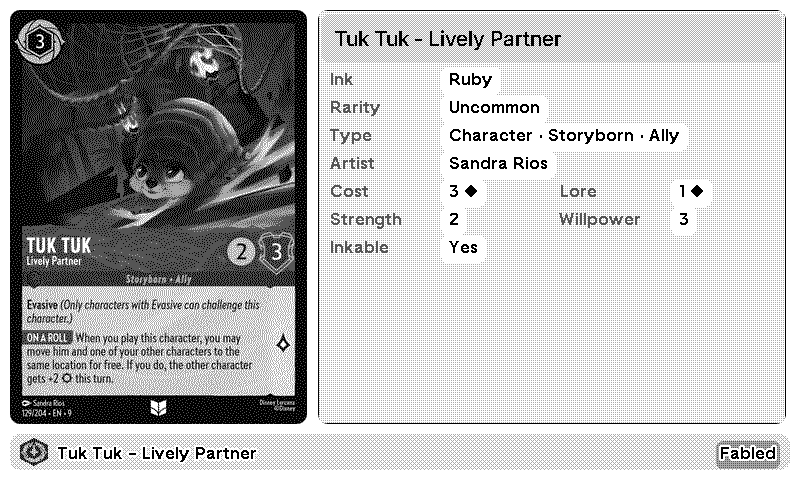

# Lorcana Cards for TRMNL

Discover Disney Lorcana cards on your TRMNL — browse sets, hunt for Enchanteds, or enjoy the artwork. Filter by ink color, rarity, type, or set. A new selection appears each refresh.

**Data:** [Lorcana API](https://lorcana-api.com) — free, no API key required.

## Features

- Filter by ink color, rarity, card type, or set
- Card stats: ink cost, lore, strength, willpower, inkable status
- Mashup-aware: each slot in a mashup shows a different card
- Rarity highlighting: Enchanted, Legendary, Super Rare

## Caching

The backend is deliberately gentle on the Lorcana API. Each unique filter combination (color + rarity + type + set) is cached independently in Redis.

**How it works:**

1. On first request for a filter combo, the backend fetches matching cards from the Lorcana API and stores up to 200 in Redis with a timestamp.
2. On subsequent requests within the refresh window (default: 1 hour), cached cards are returned immediately — no API calls made.
3. Once the cache is older than the refresh window, the next request triggers a **background refresh** while still returning stale data instantly. The display never blocks waiting for fresh data.
4. If the API returns nothing (e.g. an invalid filter), a 5-minute backoff is stored so the API is not retried immediately.
5. Each TRMNL refresh randomly picks up to 4 cards from the cached pool, giving variety without extra API calls.

## Self-hosting

```bash
cp .env.example .env
# edit .env as needed
docker compose up -d
```

Default port: `8696`. Configure via `BACKEND_PORT` in `.env`.

The backend expects a Redis instance. Docker Compose starts one automatically.

## Environment variables

| Variable | Default | Description |
|---|---|---|
| `REFRESH_HOURS` | `1` | How often cached card pools are refreshed |
| `ACCESS_MODE` | `whitelist_only` | `whitelist_only` / `rate_limited` / `open` |
| `PUBLIC_RATE_LIMIT_WINDOW_SECONDS` | `300` | Rate limit window for public callers |
| `REDIS_HOST` | `redis` | Redis hostname |
| `REDIS_PORT` | `6379` | Redis port |
| `BACKEND_PORT` | `8696` | Exposed backend port |

<!-- PLUGIN_STATS_START -->
## 🚀 TRMNL Plugin(s)

*Last updated: 2026-05-31 08:41:52 UTC*


##  [Lorcana Cards](https://trmnl.com/recipes/298482)

 



### Description
Discover Disney Lorcana cards on your TRMNL — browse sets, hunt for Enchanteds, or enjoy the artwork. Filter by ink color, rarity, type, or set. A new selection appears each refresh.<br/><br/><strong>Data:</strong> <a href="https://lorcana-api.com" target="_blank">Lorcana API</a>.

---

<!-- PLUGIN_STATS_END -->
